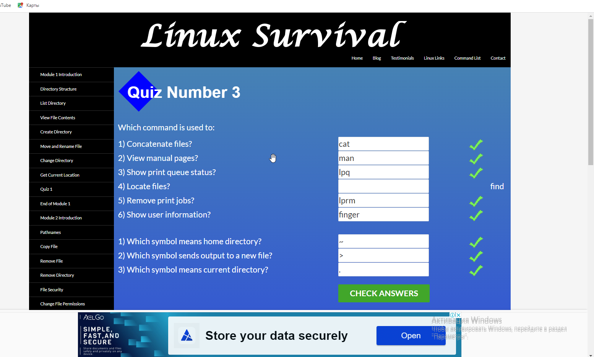

# cottans-frontend
1.Git та GitHub

1.1 Ознайомтеся з Git і GitHub.

Прослухайте тижні 1 і 2 курсу Introduction to Git and GitHub
Для того, щоб проходити курс безкоштовно, треба натиснути кнопку "Enroll for free" і потім на лінк внизу "Audit course"

2.2 Пройдіть наступні рівні тут learngitbranching:

Основи: Introduction Sequence
Віддалені репозиторії: Push & Pull -- віддалені репозиторії в Git!

## Linux CLI, and HTTP
2. Linux, Command Line, HTTP Tools

2.2 Linux Survival

## Git Collaboration
3. Git для командної співпраці

3.1 Прослухайте тижні 3 і 4 курсу Introduction to Git and GitHub

3.2 Пройдіть наступні рівні learngitbranching.js.org:
Основи: Їдемо далі, Переміщуємо роботу туди-сюди
Віддалені репозиторії: Через origin – до зірок. Прогресивне використання Git Remotes
Зроблені ще з самого початку(крім останнього), в теці будуть копії скрінів